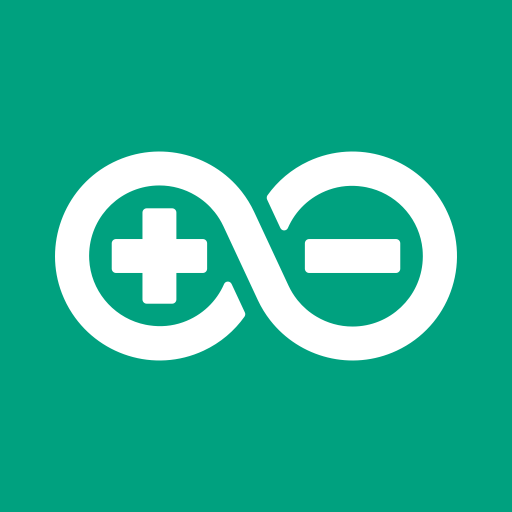

# Zendure Cloudless

Self-hosted local energy management dashboard and Home Assistant integration for Zendure SolarFlow systems.



## Features

- ⚡ **100% Local Control**: Communicate directly with Zendure SolarFlow hub devices via local REST API and MQTT without cloud dependency.
- 🏠 **Home Assistant Integration**: Auto-discovers all sensors, metrics, and state controls in Home Assistant via MQTT Discovery.
- 📊 **Real-time Monitoring**: Monitor solar input, battery charge/discharge power, battery SOC, output home power, and temperature in real time.
- 🎯 **Smart Modes**:
  - **Auto / Self-Consumption Mode**: Dynamically adjusts battery output to match household consumption.
  - **Custom / TOU Mode**: Configure scheduled charge/discharge slots based on electricity tariff hours.
- 📈 **Energy History**: Tracks daily and total energy metrics (`kWh`) for solar production and battery usage.

## Architecture

- **Backend**: Node.js, Express, WebSocket, SQLite, MQTT Client.
- **Frontend**: React, Tailwind CSS, Vite.
- **Home Assistant Add-on**: Docker container with ingress support.

## Getting Started

### Local Development

1. **Clone the repository:**
   ```bash
   git clone https://github.com/JamesDAdams/zendure-cloudless.git
   cd zendure-cloudless
   ```

2. **Install dependencies:**
   ```bash
   npm install
   ```

3. **Start backend and frontend in development mode:**
   ```bash
   npm run dev
   ```

   - Backend running on `http://localhost:3001`
   - Frontend running on `http://localhost:5173`

4. **Run tests:**
   ```bash
   npm test --workspace=backend
   ```

### Running with Docker

```bash
docker build -t zendure-cloudless .
docker run -d -p 3001:3001 -v zendure-data:/data zendure-cloudless
```

### Installing as a Home Assistant Add-on

1. Open **Home Assistant** -> **Settings** -> **Add-ons** -> **Add-on Store**.
2. Click the three dots (top right) -> **Repositories**.
3. Add your repository URL: `https://github.com/JamesDAdams/zendure-cloudless`.
4. Find **Zendure Cloudless** in the add-on store and click **Install**.
5. Start the add-on and click **Open Web UI**.

## License

MIT License.
